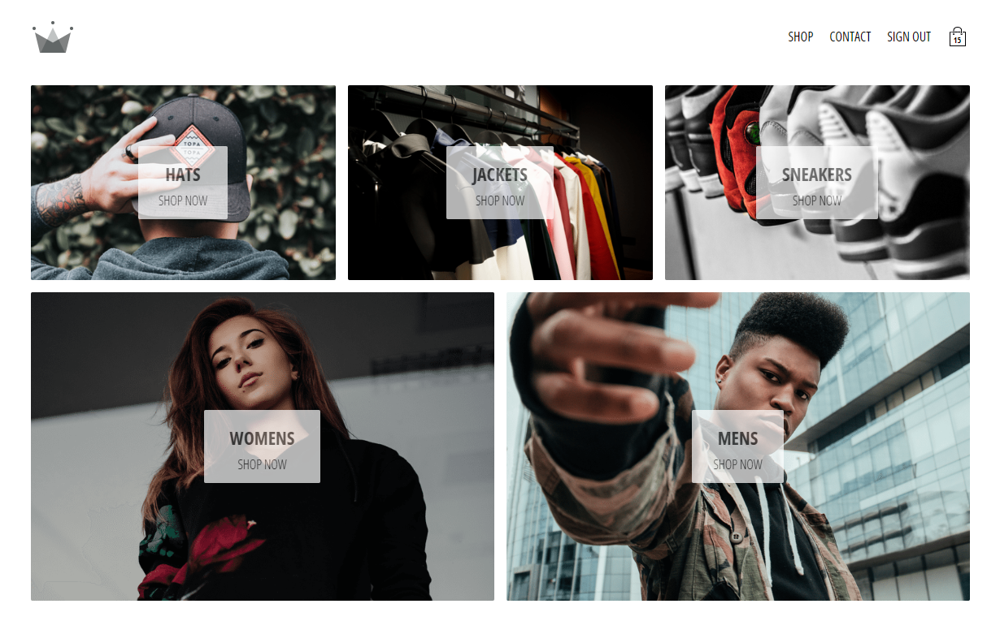
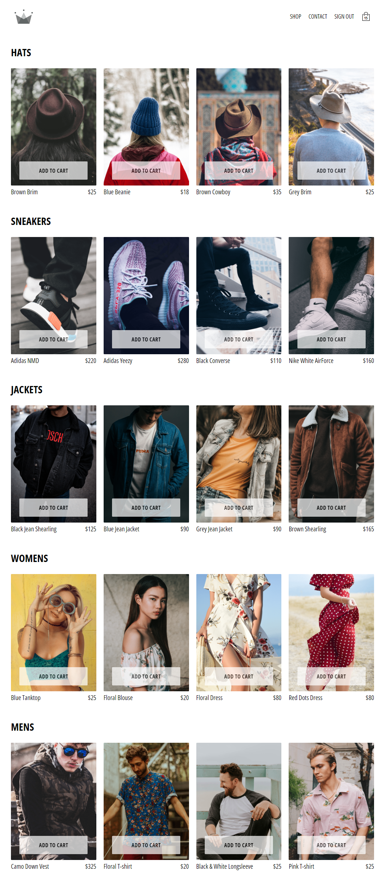

# Crown Clothing E-Commerce App

An e-commerce web application built with React, Firebase, Redux Toolkit, Stripe, and other technologies.




## Table of Contents

- [Crown Clothing E-Commerce App](#crown-clothing-e-commerce-app)
  - [Table of Contents](#table-of-contents)
  - [Demo](#demo)
  - [Description](#description)
  - [Features](#features)
  - [Technologies](#technologies)
  - [Author](#author)
  - [Installation](#installation)

## Demo

You can experience the app live at [https://your-app-url.com](https://your-app-url.com).

## Description

This is a small e-commerce app designed to showcase key features such as user authentication, product listings, shopping cart, and secure payment processing with Stripe.

Key features include:

- User authentication using Firebase (Google Sign-In and Email/Password)
- Product catalog and shopping cart
- Seamless and secure payment processing with Stripe API
- User-friendly and responsive user interface
- State management with Redux Toolkit
- State selection optimization with Reselect
- Local storage state persistence with Redux Persist
- Dynamic routing with React Router DOM
- Styling with SCSS

## Features

- **User Authentication**: Users can create accounts, sign in with Google, or use email and password for authentication.

- **Product Listings**: Display a variety of products with images, and prices.

- **Shopping Cart**: Users can add and remove items from their cart.

- **Payment Processing**: Securely process payments using the Stripe API.

- **State Management**: Manage application state using Redux Toolkit.

- **State Selection Optimization**: Enhance performance by optimizing state selection with Reselect.

- **Local Storage Persistence**: Persist application state to local storage for a seamless user experience.

- **Dynamic Routing**: Use React Router DOM for dynamic routing to different parts of the app.

- **Styling**: Style app with SCSS for flexibility and maintainability.

## Technologies

- [React](https://reactjs.org/)
- [Firebase](https://firebase.google.com/)
- [Stripe API](https://stripe.com/docs/api)
- [Redux Toolkit](https://redux-toolkit.js.org/)
- [Reselect](https://github.com/reduxjs/reselect)
- [Redux Persist](https://github.com/rt2zz/redux-persist)
- [React Router DOM](https://reactrouter.com/web/guides/quick-start)
- [SCSS](https://sass-lang.com/)

## Author

- Frontend Mentor - [@Trayshmhirk](https://www.frontendmentor.io/profile/Trayshmhirk)
- Twitter - [@TrayShmhirk01](https://www.twitter.com/TrayShmhirk01)

## Installation

Follow these steps to install and run the project locally:

1. Clone the repository:

   ```bash
   git clone https://github.com/yourusername/your-repo.git
